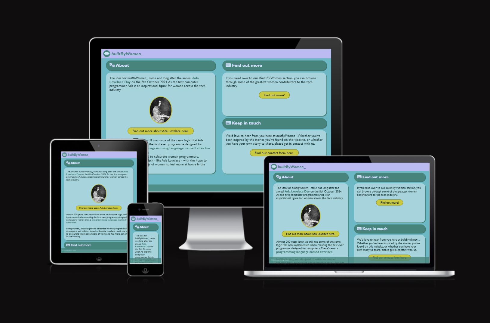
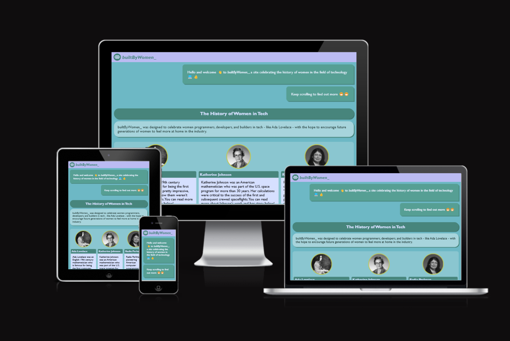

# <i>builtByWomen\_</i>

Website Url: [https://jevpr.github.io/Project-1/](https://jevpr.github.io/Project-1/)

## Table of Contents

### 1. [Project Overview](#project-overview)

- [Purpose](#purpose)
- [Audience](#audience)

### 2. [Design](#design)

- [Name](#name)
- [Colour Palette](#colour-palette)
- [Balsamiq Wireframes](#balsamiq-wireframes)

### 3. [Features](#features)

- [Navigation Bar](#navigation-bar)
- [Landing Page](#landing-page)
- [Profiles](#profiles)
- [About and Contact](about-and-contact)
- [Under Construction](#under-construction)
- [Features left to implement](#features-left-to-implement)

### 4. [Testing](#testing)

- [Responsive](#responsivity)
- [Browser Friendly](#browser-friendly)
- [Accessible](#accessible)
- [Validator Testing](#validator-testing)
- [Unfixed Bugs](#unfixed-bugs)

### 5. [GitHub and Deployment](#github-and-deployment)

### 6. [Credits](#credits)

- [Media](#media)
- [Content](#content)

## Project Overview

### Purpose:

The purpose of this project was to create an informative, easy-to-use website that detailed the history of women in technology.

I wanted the site to look professional, be clear and informative, but also be fun to use.

### Audience

My target audience was younger users, ideally girls 8 years +. As a result:

- The site needed an <em>accessible style</em> that would be appropriate for younger users. I took inspiration from the [BBC Bitesize website](https://www.bbc.co.uk/bitesize/topics/zx24xg8/articles/zprj7ty#zhrkjfr) layouts and [CGP Revision books](https://www.theworks.co.uk/dw/image/v2/BDXF_PRD/on/demandware.static/-/Sites-master-catalog-tws-uk/default/dwb3e29f89/9781782945598_1_Z.jpg?sw=400&sh=400&sm=fit).
- Content on the page needed to be kept <em>short</em>, to keep younger audiences engaged.
- Layout, colours, and formatting needed to be <em>fun and playful</em>.
  <br>
  builtByWomen\_ was designed to celebrate women programmers, developers, and builders in tech - like Ada Lovelace - with the hope to encourage future generations of women to feel more at home in the industry.
  <br>
  <br>

## Design

### Name

The initial working name for the site was 'womenInTech\_', but this always had to change because that site already exists. I wanted a name which emphasized the roles women played as founders and innovaters. So rather than 'women <b>in</b> tech,' I chose 'built <b>by</b> women'.

### Colour Palette

When considering color palette, I wanted to choose something that had a feminine feel to it. I wanted something a bit playful, that wasn't overly corporate. However, I wanted to avoid stereotypically 'feminine' colors like pink.

So, I chose the following color palette using the [coolors.co](https://coolors.co/) website.


> To do: COLOR PALETTE ACCESSIBILITY

### Balsamiq Wireframes

The following picture shows my initial mobile-first website design:


<br>
<br>

## Features

### Navigation Bar

The navigation bar is a drop down, fixed to the top of the screen so it's always available to help users navigate the site. The logo in the top left hand corner has been animated using JavaScript, so that it turns like a dial to reveal the menu. This design is playful and meant to recreate the feeling of physical mechanisms.


### Landing Page

The Landing page uses animation to engage the reader as soon as they visit the site. The two messages that pop up at the top of the screen (emulating WhatsApp messages), were designed to appeal to younger (Digital Native) users.

Below these two initial messages, you can see an overview of the websites profile pages. This section has been made responsive for difference screen sizes using Flexbox.


### Profiles

This was the most challenging page to make resopnsive, as it features a timeline detailing the history of each profilee.

For each type of screen: mobile, tablet, laptop and desktop, the timeline morphs to take on a different layout. This as done using flexbox.


### About and Contact

The About and Contact pages both take on a similar masonry layout for larger screne sizes, or a columnar layout for mobile.

The 'About' page gives users information about the website's creation. Calls to action are present throughout to keep the page engaging, and text blocks are kept short and spaced. There are internal links to direct users to other parts of the site.

The 'Contact' page features a submission form, and internal links to direct users to other parts of the site. Within the form, users can get in contact with the site developers.




### Under Construction

There is an under construction layout for profiles that are still being developed.


### Features Left to Implement

Nav Bar: In future updates, I will play with having the logo in the top right hand corner - so it's more accesible for mobile users.

Form: I would like the form to also take story submissions from users, so they can share their experiences. These submissions would then be posted on a Forum page on the website.

Under construction: I would like to create a random fact generator for the under construction page. This would guide traffic back into the website with fun facts that linked to completed profiles.

## Testing

The project was tested by several users, to ensure all features work as intended. The site has proven easy to use, and is straightforward for those wanting to learn more about the history of women in tech.

### Responsive

The website is fully responsive for phones, tablets, laptops and desktops. Here, I have tested out the site's responsivity via <em>Am I responsive?</em> website:



For tests, I used [Am I Responsive?](https://ui.dev/amiresponsive?url=https://jevpr.github.io/Project-1/).

### Browser Friendly

The site has been tested for the following browsers: Chrome, Firefox, Safari, Edge, Vivaldi, Brave, and Tor Browser.

For tests, I used [Browserling.com](https://www.browserling.com/browse/win10/safari5.1.5/https://jevpr.github.io/Project-1/).

### Accessible

I checked accessibility by running my site through the Lighthouse tool on Google Dev tools.


### Validator Testing

HTML
No errors were returned when passing through the official [W3C Nu HTML Checker](https://validator.w3.org/nu/).

CSS
No errors were found when passing through the official validator - [W3C CSS Validator](https://jigsaw.w3.org/css-validator/validator). The document validates as CSS level 3 + SVG.

### Unfixed Bugs

This project has no unfixed bugs.

## GitHub and Deployment

This website was linked with GitHub by <em>initalizing a respository</em> via Visual Studio Code. This created a new responsitory on my GitHub, where I could commit and sync changes I made on my local computer.

During this process, I had to type some commands into the console:

```
git init -b main

git config --global user.name "your-github-name"

git config --global user.email "your-email"
```

I deployed the website using GitHub's in-built deployment feature, accessed through Settings > Pages for my Project 1 Respository.

Live Link: [https://jevpr.github.io/Project-1/](https://jevpr.github.io/Project-1/)

## Credits

### Media

- I created the Logo image and timeline arrow in Microsoft Paint.
- Timeline Images were screenshots of icons from [Font Awesome](https://kit.fontawesome.com/d764441fbc.js).
- Images of Ada Lovelace, Katherine Johnson, and Radia Perlman are public and were taken from WikiMedia Commons:

  - <em>Ada Lovelace</em>: [Here](https://commons.wikimedia.org/wiki/File:Ada_Lovelace_in_1852.jpg)
  - <em>Katherine Johnson</em>: [Here](https://commons.wikimedia.org/wiki/File:Katherine_Johnson_1983.jpg)
  - <em>Radia Perlman</em>: [Here](https://commons.wikimedia.org/wiki/File:Radia_Perlman.png)

### Content

- Written content on the Landing, About, Contact, and construction pages is my own.
- Written content on Ada Lovelace's profile was adapted and composed from the following sources:

1. [Ada: A Life and Legacy, Dorothy Stein](https://monoskop.org/images/e/e7/Stein_Dorothy_Ada_A_Life_and_a_Legacy.pdf)
2. [Ada Lovelace, NYTimes](https://www.nytimes.com/interactive/2018/obituaries/overlooked-ada-lovelace.html)
3. [Ada Lovelace, Britannica](https://www.britannica.com/biography/Ada-Lovelace)
4. [Ada Lovelace, Wikipedia](https://en.wikipedia.org/wiki/Ada_Lovelace)
5. [Ada Lovelace, findingada.com](https://findingada.com/about/who-was-ada/)
6. [Untangling the Tale of Ada Lovelace, Stephen Wolfram](https://writings.stephenwolfram.com/2015/12/untangling-the-tale-of-ada-lovelace/)
7. [Ada Lovelace: King, Countess, Genius, Nottingham City of Literature](https://nottinghamcityofliterature.com/blog/ada-lovelace-king-countess-genius/)

### [Back to the top.](#builtbywomen_)
